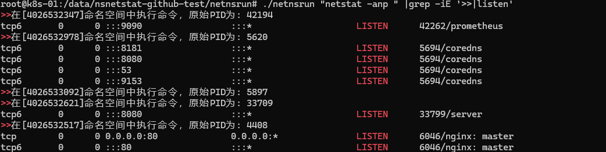

# NetNamespace Runner 🛠️

在多个Linux网络命名空间中执行命令的轻量级工具（类似`nsenter`的自动化增强版）

## 功能特性 🌟
- 自动遍历系统所有网络命名空间
- 跨命名空间执行指定命令
- 保留原始PID和inode信息
- 支持标准输入/输出透传
- 基于Go的跨平台编译（目前支持Linux）

## 使用场景 🎯
- 容器网络调试
- 多网络命名空间监控
- 批量网络配置
- 网络隔离环境测试

## 快速开始 🚀
```bash
# 克隆仓库
git clone https://github.com/s-h/netnsrun.git
cd netnsrun

# 编译程序
go mod tidy
go build -o netnsrun main.go

# 运行程序
sudo ./netnsrun "你的命令"

# 根据原始pid可以查找运行进程
pstree -pl |grep -A5 原始pid
```
